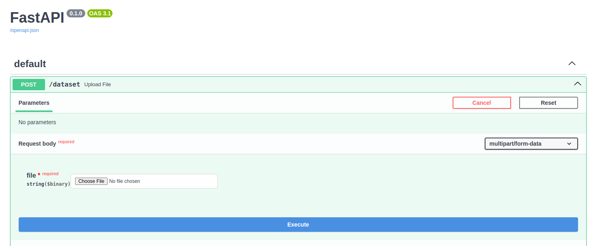

# Пограммная реализация решения кейса "Координация пропуска вагонопотока" 
### :hammer_and_wrench: Languages and Tools :

<div align="center">
  
  
  
</div>

## :japanese_goblin: Запуск приложения
### Данное приложение можно запустить в любой среде, где запускается Docker
Склонируйте проект
```
git clone https://github.com/zayycev22/train_api.git
```

Запустите контейнер
```
docker-compose up
```

После того как контейнер запустится, вам будет доступен сайт по ссылке
```
http://127.0.0.1:8000/docs
```
На этой странице указана документация к api и возможность интерактивного взаимодействия с ней

Выберите `/dataset`, нажмите кнопку `try out`, у вас появится возможность подгрузки json файла
Ps. Если файл сломан или неверно заполнен - вернется ошибка 400, поэтому заранее подготовьте файл или возьмите любой из папки `files` кроме upload.json

После того как вы загрузили файл - нажмите кнопку `execute`, ниже на сайте в `Response body` появится ответ от сервера (Если вы загружали массив данных - вернется массив, иначе одиночный ответ)

Ниже на картинке представлен пример того, как у Вас должен выглядеть сайт




## :mag: Описание метода имитации отжига

За основу алгоритма имитации отжига взят процесс кристаллизации вещества, который в свою очередь «приручили» хитрые металлурги, для повышения однородности металла.

У каждого металла есть кристаллическая решетка, она описывает геометрическое положение атомов вещества. Совокупность позиций всех атомов будем называть состоянием системы, каждому состоянию соответствует определенный уровень энергии. Цель отжига – привести систему в состояние с наименьшей энергией. Чем ниже уровень энергии, тем «лучше» кристаллическая решетка, т.е. тем меньше у нее дефектов и прочнее металл.

## :octocat: Описание приложения

Веб-приложение, основанное на алгоритме искусственного интеллекта имитации отжига. Приложив входной json файл, содержащий информацию о поездах, их маршрутах и потребностях городов, на выходе получаем json файл с оптимизированными маршрутами поездов и их вагонопотоком.

С развертыванием и использованием приложения можно ознакомиться [здесь](https://disk.yandex.ru/d/KbfLLosBFpKg6Q). 
